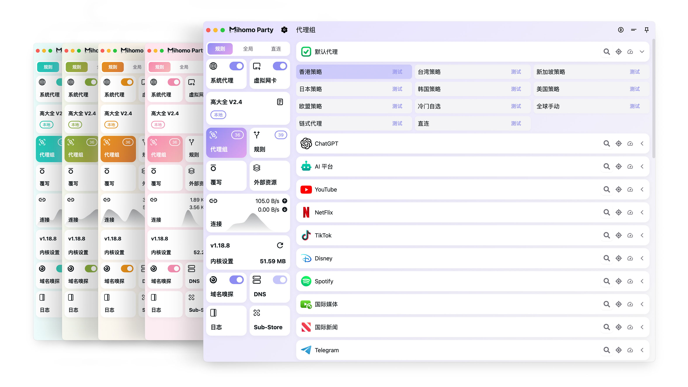

<h3 align="center">
  
  
</h3>

<h3 align="center">Another <a href="https://github.com/MetaCubeX/mihomo">Mihomo</a> GUI</h3>

  
  

### 本项目由“[狗狗加速](https://party.dginv.click/#/register?code=ARdo0mXx)”赞助
##### [狗狗加速 —— 技术流机场 Doggygo VPN](https://party.dginv.click/#/register?code=ARdo0mXx)

- 高性能海外机场，稳定首选，海外团队，无跑路风险
- Mihomo Party专属8折优惠码：party，仅有500份
- Party专属链接注册送 3 天，每天 1G 流量 [免费试用](https://party.dginv.click/#/register?code=ARdo0mXx)
- 优惠套餐每月仅需 15.8 元，160G 流量，年付 8 折
- 全球首家支持Hysteria1/2 协议，集群负载均衡设计，高速专线，基于最新UDP quic技术，极低延迟，无视晚高峰，4K 秒开，配合Mihomo Party食用更省心！
- 解锁流媒体及 ChatGPT
- 官网：[https://狗狗加速.com](https://party.dginv.click/#/register?code=ARdo0mXx)

### 特性

- [x] 开箱即用，无需服务模式的 Tun
- [x] 多种配色主题可选，UI 焕然一新
- [x] 支持大部分 Mihomo 常用配置修改
- [x] 内置稳定版和预览版 Mihomo 内核
- [x] 通过 WebDAV 一键备份和恢复配置
- [x] 强大的覆写功能，任意修订配置文件
- [x] 深度集成 Sub-Store，轻松管理订阅

### 安装/使用指南见 [官方文档](https://mihomo.party)
