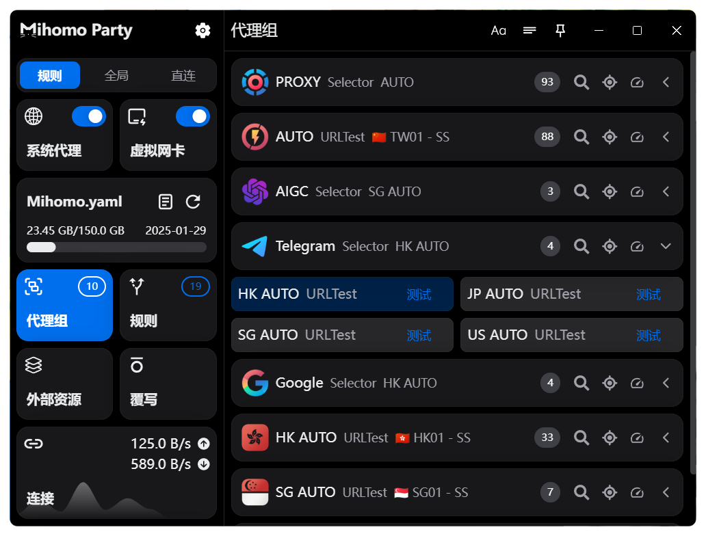
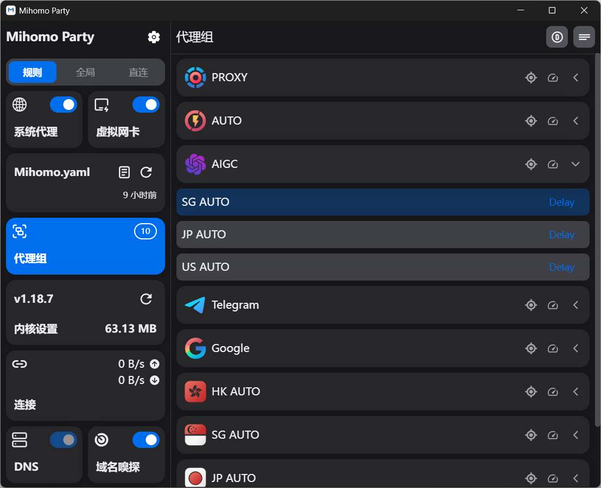
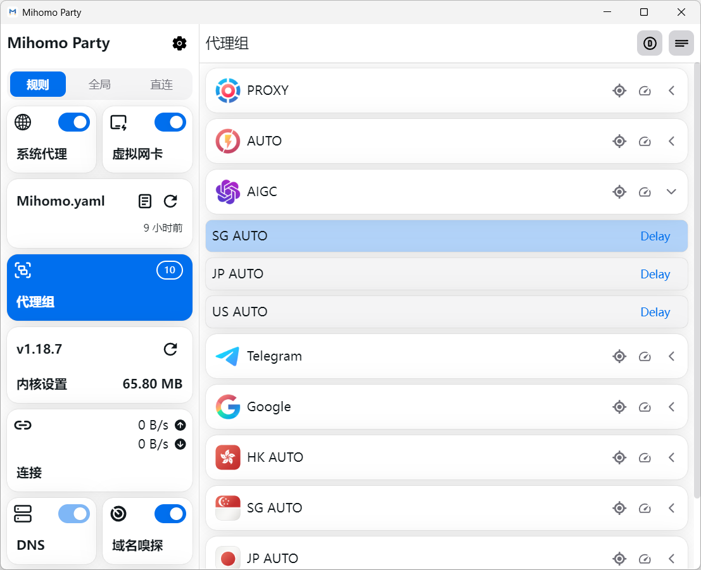
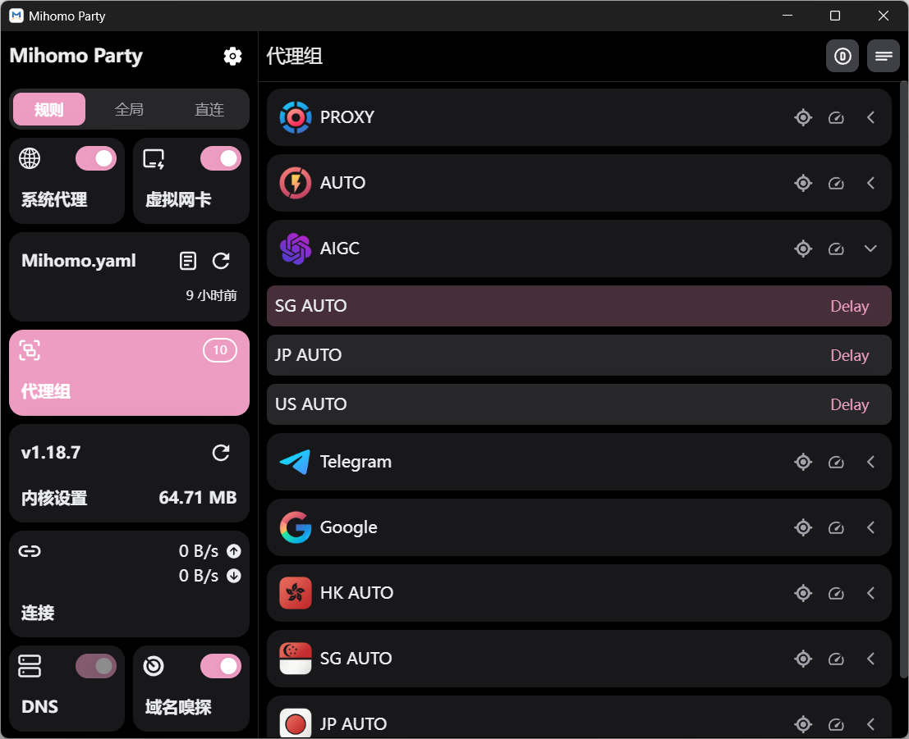
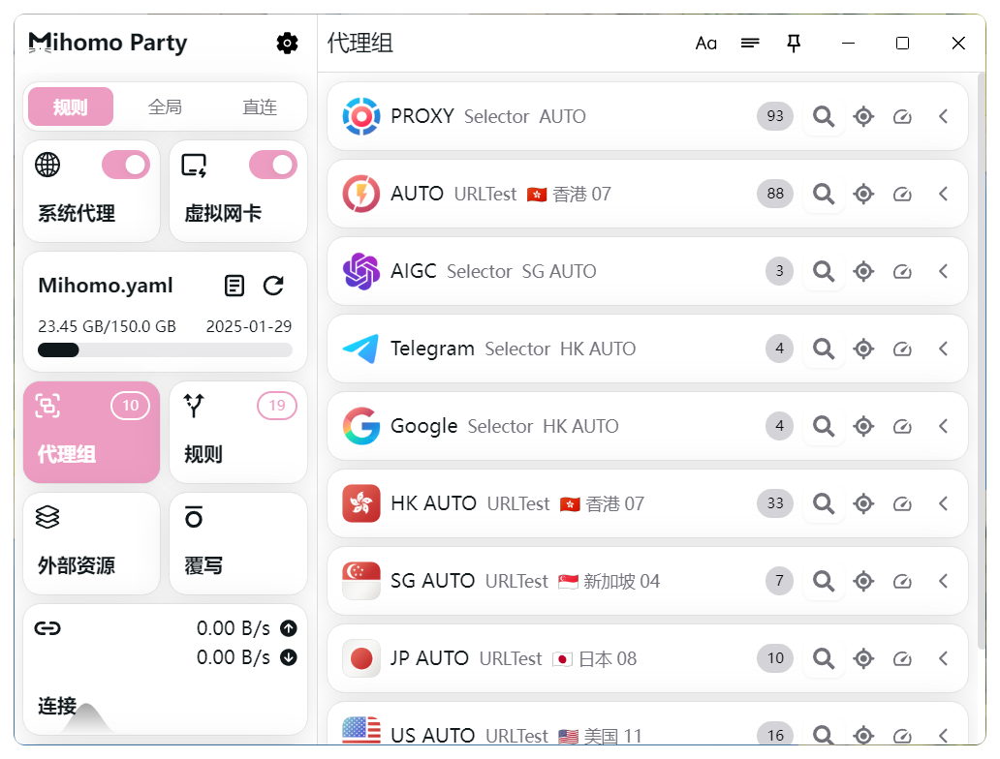
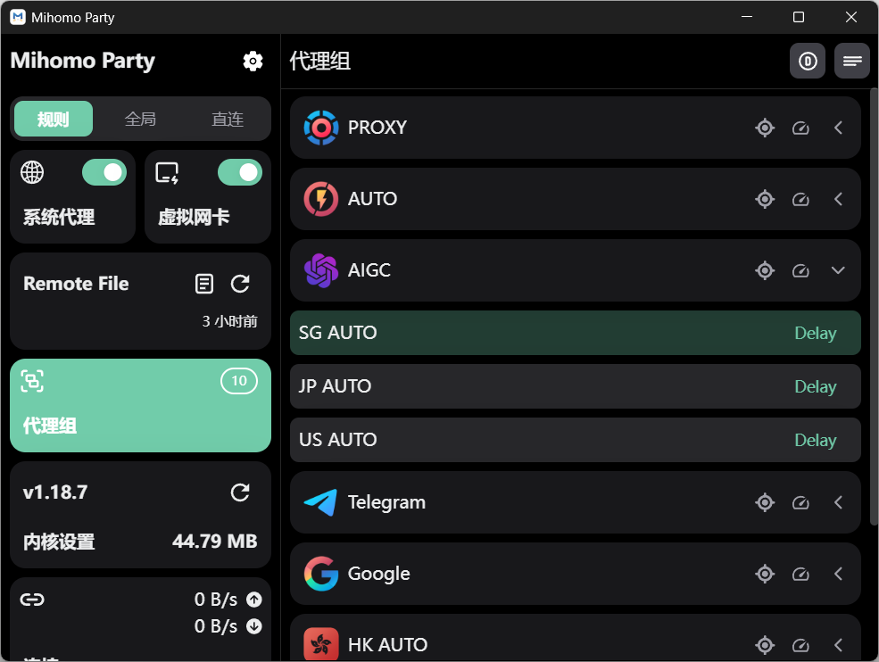
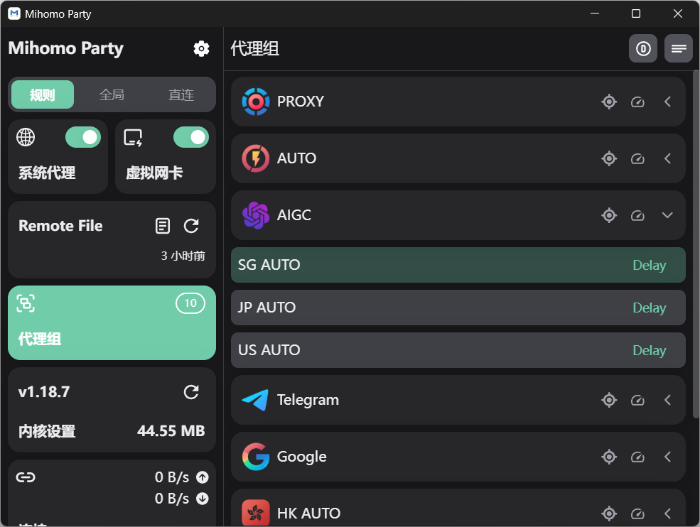
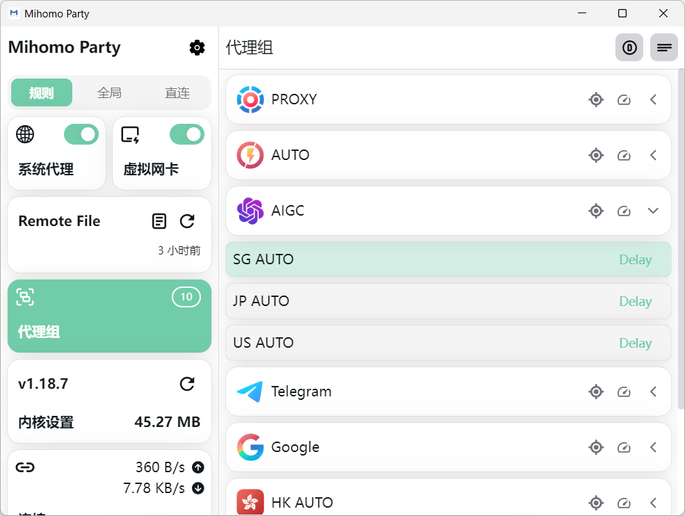

<h3 align="center">
  
  
</h3>

<h3 align="center">Another Mihomo GUI</h3>

  
  

### 特性

- [x] 开箱即用，无需服务模式的Tun
- [x] 多种配色主题可选，UI焕然一新
- [x] 支持大部分Mihomo常用配置修改
- [x] 内置稳定版和预览版Mihomo内核
- [x] 通过WebDav一键备份和恢复配置
- [x] 强大的覆写功能，任意修订配置文件
- [x] 深度集成Sub-Store，轻松管理订阅

### 安装/使用指南见 [官方文档](https://mihomo.party)
